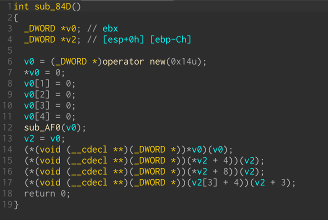
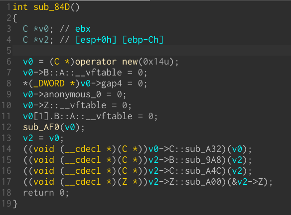
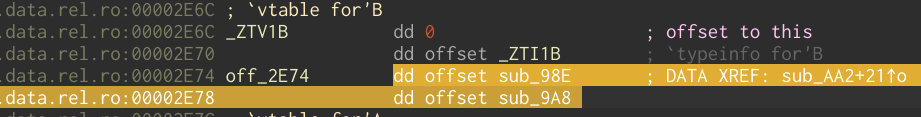
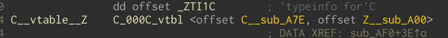
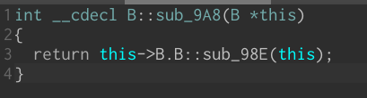
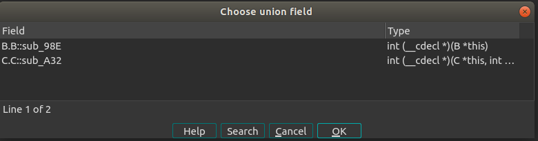
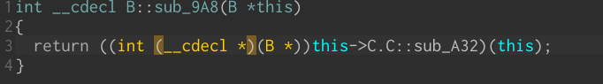

ida_medigate C++ plugin for IDA Pro

# 

[TOC]

# Motivation And Background

Reverse engineering of compiled C++  code is not fun. Static Reverse engineering of compiled C++ code is **frustrating.** The main reason which makes it so hard is virtual functions. In contrast to compiled C code, there is no clear code flow. Too many times one can spend much time trying to understand what is the next virtual function is called, rather than just see the function like in compiled C code.

When one investigates a virtual function, the amount of time he or she needs to effort in order to find its xref, is not sense.

After too many C++ RE projects, I gave up and decided I need a flexible (Python) and stable (which I can easily maintain) tool for this type of research. Most of this plugin was written in January 2018, and recently I decided to clean the dust and add support of the new IDA (7.2) classes support.

This plugin isn't intended to work always "out of the box", but to be another tool for the reverser.

# **About**

The plugin consists of two parts:

1. Implementation of C++ classes and polymorphism over IDA
2. A RTTI parser which rebuilds the classes hierarchy

This first part is not dependent on the second part, so it possible to use the plugin to reverse engineering a binary that doesn't contain RTTI, by defining those classes manually based on the plugin's API.

What makes the plugin unique is the fact it uses the same environment the researcher is already familiar with, and doesn't add any new menu or object, and based on the known IDA building blocks (structure, union, type for structure's members, etc) - **This enable the plugin to support C++ abstracting for every architecture IDA supports**.

**Note:** The RTTI parser parses x86/x64 g++ RTTI, but its structure enables to add support for more architectures and compilers **easily.**

# Requirements

* IDA 7.5 SP  + Hex-Rays Decompiler + Python 3
  * This version we partially support disassembly with no decompiler
* Linux - There is no anything that really depends on Linux, but the plugin was tested on IDA Linux version.
* [ida-referee](https://github.com/joeleong/ida-referee): We use this useful plugin to save xrefs for struct's members uses in the decompiler. The original plugin doesn't support Python3 so we port it (under the directory `plugins/`)
* The itanium_demangler pure-python package.

# Installation:

Copy `medigate_cpp_plugin` to the `plugins` directory and add the source code path to your `idapythonrc.py` file

Copy `plugins/ida-referee/referee.py`to the same directory.

Install the package itanium_demangler.
```shell
pip install -r requirements.txt
```

# Features:

Assuming the binary original source code is the following (`examples/a.cpp`):

```c++

using namespace std;

class A {
	public:
	int x_a;
	virtual int f_a()=0;
};

class B : public A{ 
	public:
	int x_b;
	int f_a(){x_a = 0;}
	virtual int f_b(){this->f_a();}
};

class Z {
	public:
	virtual int f_z1(){cout << "f_z1";}
	virtual int f_z2(){cout << "f_z2";}
};

class C: public B, public Z{
	public:
    int f_a(){x_a = 5;}
	int x_c;
	int f_c(){x_c = 0;}
	virtual int f_z1(){cout << "f_z3";}
};


int main()
{
	C *c = new C();
    c->f_a();
    c->f_b();
    c->f_z1();
    c->f_z2();
    
	return 0;
}
```

The binary is stripped but contains RTTI.

## RTTI Classes Hierarchy Rebuilding

When we just load the binary, the `main` function (`sub_84D` in the 32 bit version) looks like:



Initiate the g++ RTTI parser and run it, using:

`from ida_medigate.rtti_parser import GccRTTIParser`

`GccRTTIParser.init_parser()` 

`GccRTTIParser.build_all()`

Now refresh struct C (see Remarks section), cast `v0` to be `C *`, decompile again:



## Manual Classes Hierarchy Rebuilding

For cases that there are no RTTI, our infrastructure still enables to manually define c++ class. For the same example (examples/a32_stripped) you can create manually struct B, then select it's virtual table and type




`from ida_medigate import cpp_utils`

`cpp_utils.make_vtable("B")`

`make_vtable` can also get `vtable_ea` and `vtable_ea_stop` instead of the selected area.

Then create struct C, and apply the inheritance:

`cpp_utils.add_baseclass("C", "B")`

Now you can rebuild class C vtable by selecting it and typing:

`cpp_utils.make_vtable("C")`

Add structure Z, rebuild its vtable too, and now is the cool part:

`cpp_utils.add_baseclass("C", "Z", 0x0c, to_update=True)` which apply C inheritance of Z at offset 0x0c and refresh the struct too (see remarks).

The last thing remained is too update the second vtable of C, the one that implements the interface of Z. Mark this vtable and type:

`cpp_utils.make_vtable("C", offset_in_class=0x0c)`

ida_medigate knows that this vtable is the vtable of class Z and the result will be:



The final result is the same like in the RTTI case:


## Synchronization between functions and vtable members

When new a vtable struct is created (by the RTTI parser of manually by the user) each function which hasn't changed yet is renamed, decompiled, and set its first argument to `this`.

Double click on a structure's member which corresponds to such a function will navigate to the function, so the user can read the C++ code flow in a convenient way!

Every name or type changing of a function or its corresponding function pointer member in vtables is hooked and synchronized among all of them. This means for example, the user could change the vtable member type through the decompiler window, and this new type (prototype) will be applied on the target function too.

## Convenient reading of polymorphic code

In line 15 at the previous image, there is a call to B::sub_9A8 (B::f_b in the source code). This function argument is `B *`:



But, this function also might be called by a `C` instance (up-casting). we want to see the virtual function it's instance would call. Assume there are many potential derived classes so casting `this` to `C *` not always possible. For that reason, we implement a union for each baseclass that has sons that have a different virtual table. One can choose to show a different derived virtual table of `B `'s derivatives by click alt+y (the shortcut for choosing different union member):



so ultimately we can "cast" only specific calls to different virtual function:



## **Virtual Functions xref**

The holy-grail of frustrated C++ reverse engineers. We maintain xrefs from virtual functions to the vtable struct's members which represents them!

Combining this with `ida-referee` enables us to track all the xrefs of virtual functions calls!


*A limitation: we can only track virtual calls which already been decompiled. Fortunately, the auto-analysis knows to populate an argument type between functions, so with the iterative process of casting more arguments->decompiling all the relevant functions -> reading the code again and casting more arguments (...) this ability becomes really **powerful!***

# Remarks

* The way we mark structure members as subclasses in IDAPython isn't synchronized right away to the IDB. The hack we do is to edit the structure so a synchronization will be triggered. You also may use

  `utils.refresh_struct(struct_ptr)`

  which adds a dummy field at the end of the struct and then undefined it.